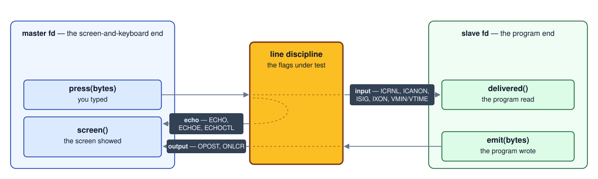

# tty-puzzles

Take a tty apart one flag at a time, then build it back in userspace.

Your tty does a startling amount of work for you. It shows you what you
type. It lets you fix a typo before the program sees the line. It turns three
bytes into signals. It translates your Return key. None of that is the terminal
*emulator* and none of it is your program — it's the kernel's **line
discipline**, and every part of it is a flag you can switch off.

Fifteen puzzles. The first seven switch a service off and watch what breaks;
the next four make you the service; the last four leave the kernel behind and
talk to the emulator. Fill in `puzzles.py` until the tests pass — every stub's
docstring is its spec.

> The long-form writeup lives in the blog series: [Take a terminal apart,
> then build it back][post] walks the ladder these puzzles climb, and [Three
> things called raw][post3] is the reference — which thing the word
> *terminal* names, the three kernel layers under the fd, and the whole flag
> taxonomy.

## Running it

```bash
python3 test_puzzles.py        # every puzzle
python3 test_puzzles.py 2      # just puzzle 2
python3 test_puzzles.py 1 2 3  # a range
pytest test_puzzles.py -k P03  # same thing under pytest
```

In a notebook, hand the runner your own cells instead of the stub file:

```python
!git clone -q https://github.com/samlaf/tty-puzzles.git
%cd tty-puzzles
import sys; sys.modules["puzzles"] = sys.modules["__main__"]

from test_puzzles import check
check(1)
```

Edit `puzzles.py` only. `harness.py`, `tracing.py` and `test_puzzles.py` are
the rig.

`ANSWERS.md` has a worked solution and a discussion for every puzzle. Read an
entry after you've made its tests pass, or after you've been stuck long enough
that the answer will actually stick.

## The puzzles

**Part 1 — the descent.** Each puzzle switches off one service and asks what
it was worth.

| # | stub | what breaks |
|---|---|---|
| 1 | `disable_echo` | the screen stops showing your typing |
| 2 | `disable_line_buffering` | keystrokes arrive one at a time |
| 3 | `disable_signal_chars` | `^C` becomes an ordinary byte |
| 3b | `disable_signal_flush` | `^C` stops taking the half-typed line with it |
| 4 | `disable_flow_control` | `^S` stops freezing the terminal |
| 4b | `disable_extended_chars` | the kernel gives up `^V` and `^O` |
| 5 | `disable_cr_translation` | Return delivers `\r` — and stops ending the line |
| 6 | `disable_output_processing` | output crosses byte for byte |
| 7 | `make_raw`, `raw_mode` | 1–6 assembled, with a guaranteed way back |

**Part 2 — building it back.** You are the service now: userspace code on the
program side of the tty you stripped.

| # | stub | what you rebuild |
|---|---|---|
| 8 | `echo_back` | echo |
| 9 | `LineEditor` | canonical mode |
| 10 | `InterruptingEditor` | the interrupt — `0x03` means what you say it means |
| 11 | `window_size`, `watch_resize` | how big is the window, and when did it change |

**Part 3 — above the fd.** The kernel is out of opinions; everything here is
a conversation with the terminal emulator, held in-band in the same stream as
the text.

| # | stub | what you build |
|---|---|---|
| 12 | `KeyDecoder` | escape sequences back into keys |
| 13 | `read_key` | the lone-`ESC` ambiguity, settled by time |
| 14 | `alt_screen` | borrow the screen, give it back no matter what |
| 15 | `prompt` | a prompt built on nothing but what you wrote |

## How the tests can possibly work

Line-discipline behaviour looks untestable — the answer is "what a human
sees". It isn't, because of `openpty()`: a pty is a pair of fds with a real
line discipline between them, and nothing stops one process from holding both
ends. Then "what the screen shows" and "what the program reads" are two byte
strings you can assert on.



Note there are **three** legs, not two. A keystroke fans out — the program
reads it *and* the screen shows it, by separate rules — which is how puzzle 1
can switch off echo and still assert the bytes arrive: you cut one leg, not
both.

When a test fails, the runner prints every leg of the journey in caret
notation, so you can see where the bytes changed:

```
    -- trace ----------------------------------------------------
      you typed               ab^?              61 62 7f   [ERASE]
        -> the program read   (nothing within 0.25s)
      the program wrote       one^Jtwo^J        6f 6e 65 0a 74 77 6f 0a   [LF]
        -> the screen showed  one^M^Jtwo^M^J    6f 6e 65 0d 0a ...   [CR LF]
```

## Platform notes

Runs on macOS and Linux, Python 3.12+, no dependencies. A fresh pty does not
start in the same state on both, so `harness.apply_cooked()` stamps an
explicit cooked baseline on every tty before a puzzle sees it — that's what
`stty sane` is: a named destination, not a diff. `COOKED_FLAGS` in
`harness.py` has the reasoning. To see your own platform's defaults, and what
the baseline does to them:

```bash
python3 probe_defaults.py            # what your kernel hands you
python3 probe_defaults.py --cooked   # what every puzzle actually starts from
```

[post]: https://samlaf.github.io/programming/take-a-terminal-apart-then-build-it-back.html
[post3]: https://samlaf.github.io/programming/three-things-called-raw.html
